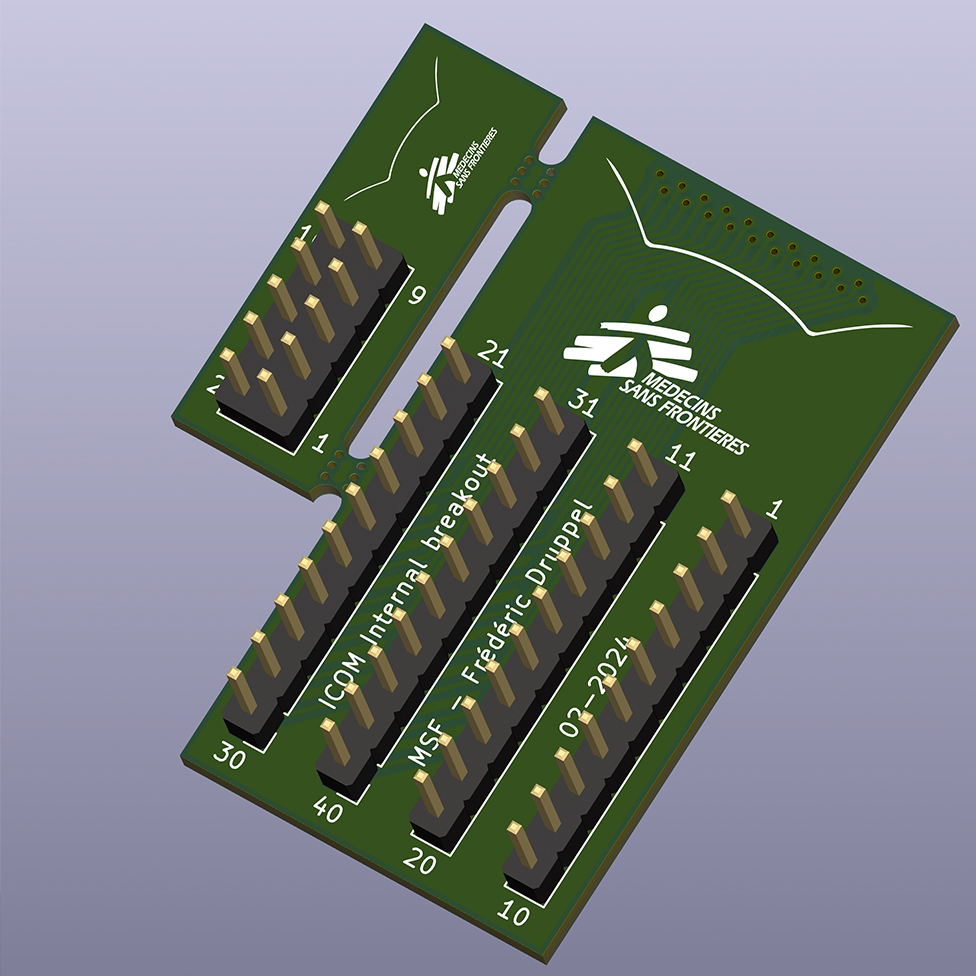
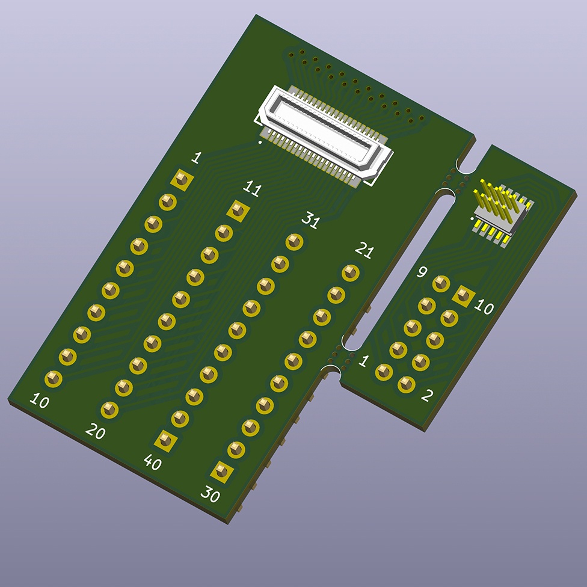

# ICOM Internal Breakouts

## Why

MSF uses a lot of ICOM IC-F5000 series radios in the field. These are VHF FM radios that can be upgraded with an internal module to work as a dPMR or NXDN radios.  
We wanted to explore the capabilities of these internal expansion connectors and see if we could use them to interface with other devices (for example an FSK modulator for pagers).

In order to do some prototyping, and after trying to solder tiny wires on the tiny pads of the PCB, I decided to design a breakout board that would make it easier to interface with the radio.

After finding the correct connectors, I designed a PCB that would fit in the radio and expose the internal connectors to more standard 2.54mm pitch headers.  
The connectors for J1 and J2 are the same, but the pinout is different as J2 is intended for DSPs like the UT-126H.

I also added a connector for the internal GPS connector, as the radio can transmit GPS positions with an *external* or *internal* GPS receiver, but I've never seen the internal GPS receiver and wanted to see if it was feasable.

## BOM

* Mating connectors for J1 and J2 : [Panasonic P5 Series P5K AXK640347YG](https://na.industrial.panasonic.com/products/connectors/board-board-connectors/lineup/narrow-fine-pitch-connectors/series/82696/model/83045)
* Mating connector for 0.8mm pitch GPS connector : [Samtec FTE-105-01-G-DV](https://www.samtec.com/products/fte)
* 4x 1x10 2.54mm pitch headers
* 1x 2x5 2.54mm pitch header

## PCBs

Here are some 3D renders of the PCBs :

> Note : Gerber files exported with default settings, you might want to re-export from KiCAD depending on your PCB manufacturer
